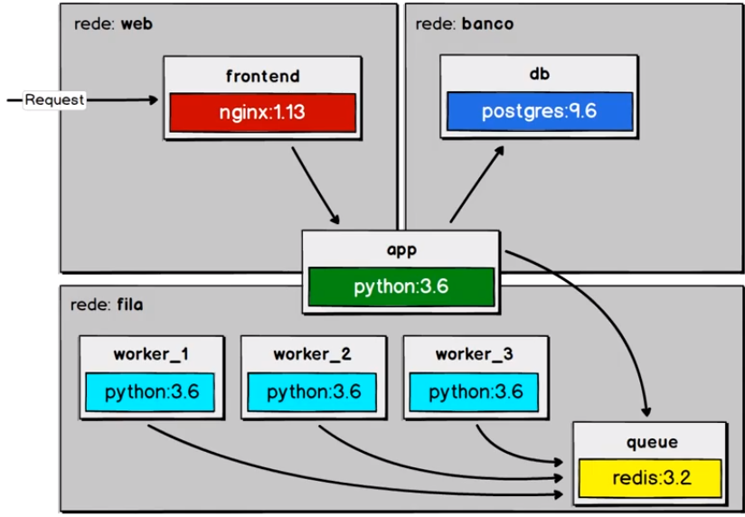

# Email Worker

Este projeto é inspirado no exercício final do curso [Docker: Ferramenta essencial para Desenvolvedores](https://www.udemy.com/curso-docker) ministrado pela [Udemy Cursos Online](https://udemy.com). 

O projeto visa explorar grande parte dos recursos disponibilizados para uso pela ferramenta de virtualização [Docker](https://docker.com), tais como: Criação de imagem, virtualização de contêineres, orquestração de contêineres (utilizando [Docker Compose](https://docs.docker.com/compose/)), e ainda Redes para comunicação entre contêineres.

A arquitetura do projeto foi baseada no seguinte diagrama:

O projeto pode ser utilizado para estudo, utilização e replicação para quaisquer fins.